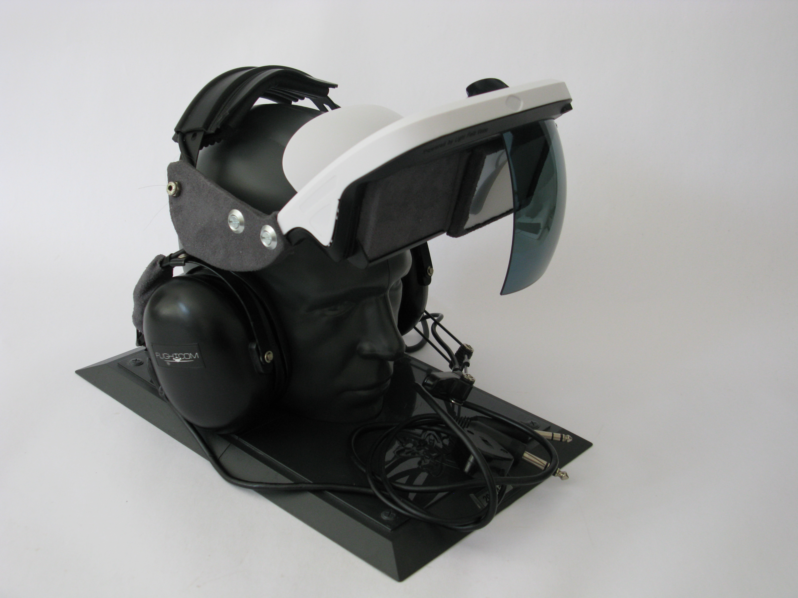

# School Project STRATUX/FLARM HUD

## Introduction

This project aims to bring an affordable heads up display system into ANY cockpit.

The focus is to improve traffic awareness and to reduce the amount of time pilots reference tablets or an EFB.

_*NOTE:*_ This project relies on having a [Stratux](http://stratux.me/) build with AHRS and GPS and a FLARM antenna using this image as of 10/10 2018: https://github.com/PepperJo/stratux/releases/download/v1.4r5-flarm2/stratux-v1.4r5-flarm-588304c8f5.img.zip


### Wearabel HUD

Using the "HUDLY Classic" projector and a Raspberry Pi 3.



Estimated cost is $300

- $40 for RaspberryPi 3
- $215 for HUDLY projector
- Fans, case, cables

Requires your aircraft to have a "12 Volt" cigarette power outlet.


## In Flight Controls
In order to change the windows I use the gesture control project from NEVMA
https://www.hackster.io/platisd/nevma-gesture-control-for-the-masses-9cff03
I use the proximity script since it is less touchy. So you will have to scroll through the windows 
You will also have to chage in "heads_up_display.py" becouse I cont find a plus key in Arduino

if event.key in [pygame.K_KP_PLUS, pygame.K_PLUS]:
to 
if event.key in [pygame.K_RIGHT:


#include <SparkFun_APDS9960.h>
#include <Keyboard.h>
// Global Variables
SparkFun_APDS9960 apds = SparkFun_APDS9960();
uint8_t proximity_data = 0;
int LED_PIN = 3; // JJD LED for if then

void setup() {

pinMode(LED_PIN,OUTPUT); //configure LED_PIN as OUTPUT 

 
 // Initialize Serial port
 Serial.begin(9600);
 Serial.println();
 Serial.println(F("------------------------------------"));
 Serial.println(F("SparkFun APDS-9960 - ProximitySensor"));
 Serial.println(F("------------------------------------"));
 
 // Initialize APDS-9960 (configure I2C and initial values)
 if ( apds.init() ) {
 Serial.println(F("APDS-9960 initialization complete"));
 } else {
 Serial.println(F("Something went wrong during APDS-9960 init!"));
 }
 
 // Adjust the Proximity sensor gain
 if ( !apds.setProximityGain(PGAIN_2X) ) {
 Serial.println(F("Something went wrong trying to set PGAIN"));
 }
 
 // Start running the APDS-9960 proximity sensor (no interrupts)
 if ( apds.enableProximitySensor(false) ) {
 Serial.println(F("Proximity sensor is now running"));
 } else {
 Serial.println(F("Something went wrong during sensor init!"));
 }
}

void loop() {
 
 // Read the proximity value
 if ( !apds.readProximity(proximity_data) ) {
 Serial.println("Error reading proximity value");
 
 } else {

 }
//Max value is 255 to make it more or less sensetive change the value in WINDOW OFF, Proximity under and WINDOW ON!! Proximity over 
 if ( proximity_data < 100 ) {
 Serial.print("WINDOW OFF, Proximity under 100: ");
 Serial.println(proximity_data); 
 Keyboard.releaseAll();
 } else {
 Serial.print("WINDOW ON!! Proximity over 100: ");
 Serial.println(proximity_data);
 Keyboard.press(KEY_RIGHT_ARROW);
 }
 delay(600);

}

You may use a number pad as input device. I used velcro to secure the number pad to my dashboard.

| Key       | Action                                                                       |
| --------- | ---------------------------------------------------------------------------- |
| Backspace | Tell the Stratux that you are in a level position. Resets the AHRS to level. |
| +         | Next view                                                                    |
| -         | Previous view                                                                |
| =         | Toggle rendering debug information                                           |
| Esc       | Send shutdown commands to both the HUD controller _*and*_ the Stratux        |
| q         | (_Full keyboard only_) Quit to the command line.                             |

## Views

- Traffic
- AHRS
- Traffic List (Text only)
- Blank

### Traffic View

#### TRAFFIC EXAMPLE


We are receiving ADS-B from three planes.
N705JA is right ahead of us, bearing 90. We have a GPS track of 112 degrees.
N705JA is 1.1 statute miles ahead, and 2,200 feet above.
We have a large red target reticle that shows where N705JA actually is outside the cockpit.

Delta Airlines flight 39 is also ahead of us, and slightly to the right.
It is further away, so the red reticle is smaller.

Note tha a red triangle points from the information card to the heading strip where the traffic is.

The closer the traffic, the larger the heading bug.

#### Traffic View Explanation

This shows you all of the traffic with reliable ADSB data.

_NOTE: Any planes further than 10SM are excluded from this view._

It attempts to prioritize traffic by distance.

At the bottom is a heading strip. It shows you in text with a green background your GPS track and your gyro based direction. Combined they will give you an idea of any crab being maintained.

To the left and right are the headings 180 degrees from center.

Drawn above the heading strip are red "bugs". The larger the heading bug, the closer the traffic is.

Right above each bug is a yellow "card" that shows you information about that traffic.

At the top is the Tail Number, and if that is not available, a unique identifier that is broadcast.
The next line is the bearing to the traffic.
Below that is the distance to the target.
Finally, the bottom line is the relative altitude in hundreds of feet. (+2 would be 200' above you.)

Cards are drawn so the furthest traffic is "at the bottom of the stack". This prioritizes the closest traffic to have all content readable.

### AHRS View

#### AHRS VIEW EXAMPLE


We have a GPS track of 153 degrees.
We are in a 28 degree turn to the left.
We are 15 degrees nose up.
Our GPS altitude is 309'
We are experiencing 0.8Gs, less than normal gravity.

### Traffic Listing View

### TRAFFIC LISTING VIEW EXAMPLE


This shows us _at most_ the five closest planes.

_NOTE: Any planes further than 10SM are excluded from this view._

Here we see N435SP is the closest plane, bearing 345, 1.0 statute miles away, and 1,300' above us.

N705JA is the second closest plane. It is Bearing 78, 1.2 statues miles away and 2,300 feet above us.

### Blank

A blank screen so no information is displayed.

## Parts List

### All Builds

_NOTE:_ This _does not_ include a power source. You will need to supply ship power from a 5V USB port or from a battery.

- [Raspberry Pi 3](https://www.amazon.com/Raspberry-Pi-RASPBERRYPI3-MODB-1GB-Model-Motherboard/dp/B01CD5VC92/ref=sr_1_3?s=electronics&ie=UTF8&qid=1529215701&sr=1-3&keywords=raspberry+pi+3)
- [Case For Raspberry Pi](https://www.amazon.com/iPhoenix-Raspberry-White-Compatible-Model/dp/B06XQSXZ97/ref=sr_1_3?s=electronics&dd=iYEspjjyeRXfqDW9BHwJFw%2C%2C&ddc_refnmnt=pfod&ie=UTF8&qid=1529215794&sr=1-3&keywords=white+raspberry+pi+3+case&refinements=p_97%3A11292772011)
- [Cooling Fan for Raspberry Pi](https://www.amazon.com/gp/product/B075R4S9GH/ref=od_aui_detailpages00?ie=UTF8&psc=1)
- [Micro USB Cable](https://www.amazon.com/AmazonBasics-Male-Micro-Cable-Black/dp/B0711PVX6Z/ref=sr_1_6?s=electronics&ie=UTF8&qid=1529215888&sr=1-6&keywords=micro+usb+cable)
- [Micro SD Card](https://www.amazon.com/SanDisk-Ultra-Micro-Adapter-SDSQUNC-016G-GN6MA/dp/B010Q57SEE/ref=sr_1_10?s=pc&ie=UTF8&qid=1529215944&sr=1-10&keywords=micro+sd+card)
- [Rottay Mechanical Keypad](https://www.amazon.com/Number-Rottay-Mechanical-Numeric-backlit/dp/B076FTSY6J/ref=sr_1_3?ie=UTF8&qid=1529215627&sr=8-3&keywords=mechanical+keypad)

### Recommended HUDLY Build

- [HUDLY Classic](https://gethudly.com/classic)
  - _NOTE:_ You will most likely want to order the cigarette lighter powered version.
  - _NOTE:_ You can order the iPhone or Android cable option based on your phone. It will not matter for the StratuxHud.
- [12" HDMI Cable](https://www.amazon.com/StarTech-com-0-3m-Short-Speed-Cable/dp/B00K3HF276/ref=sr_1_11?s=electronics&ie=UTF8&qid=1529216822&sr=1-11&keywords=short%2Bhdmi%2Bcable&th=1)

### 3D Print Build

- [Teleprompter Glass Sample of both thickness of the 60/40 glass](https://telepromptermirror.com/sample/)
- [SunFounder 5" TFT LCD](https://www.amazon.com/SunFounder-Monitor-Display-800X480-Raspberry/dp/B01HXSFIH6)

## Install instructions

### First Boot

1. Flash the latest [Raspbian](https://www.raspberrypi.org/downloads/raspbian/) to an SD card
2. Plug in a keyboard and a monitor
3. Plug in the power to the Pi.
4. Press ctrl+alt+f1 to quit from the GUI to the desktop
5. `sudo raspi-config`
6. boot options -> desktop / cli -> "Console auto-login"
7. "Advanced options" -> "Expand Filesystem"
8. "OK"
9. "Finish"
10. "Yes"
11. Wait for the reboot
12. `sudo raspi-config`
13. "Network options" -> "WiFi"
14. Choose your country. Pressing "u" will take you to USA.
15. Enter your network name and password.
16. "Interfacing Options" -> "Enable SSH"
17. "Localization" -> "Change Keyboard Layout" -> "Generic 104"
18. "Other" -> "English US" -> "Default" -> "No compose" -> "Yes"
19. "Finish"

#### Raspberry Pi 3B+

If you are using a 3B+, it may suffer from undervoltage alerts.
These may be relieved by the following command to update your Linux install to the latest:

```bash
sudo apt-get update && sudo apt-get dist-upgrade -y
```

Make sure you are using a high quality power cable if you are using a Pi 3B+

### Install Software

1. Enter `ping google.com`. Press ctrl+c after a while. This will confirm that you have internet access. If you do not, then use rasp-config to re-enter your wi-fi
2. `cd ~`
3. `git clone https://github.com/JohnMarzulli/StratuxHud.git`
4. `cd StratuxHud`
5. `python --version`. Verify that your version is 2.7.14
6. `sudo python setup.py develop`
7. `sudo raspi-config`
8. Choose "WiFi" again, and enter `stratux` as the SSID. No password.
9. `sudo vim /etc/wpa_supplicant/wpa_supplicant.conf`
10. Delete the section that contains your WiFi network, leaving the section that contains the Stratux network.
11. More info on configuring Linux WiFi: <https://www.raspberrypi.org/forums/viewtopic.php?t=160620>
12. Save and quit.
13. Type "crontab -e"
14. Select "Nano" (Option 1)
15. Enter the following text at the _bottom_ of the file:

```bash
@reboot sudo python /home/pi/StratuxHud/stratux_hud.py &
```

1. Save and quit.

### HUDLY Based Setup

1. Install the HUDLY projector per the HUDLY directions. It is handy to have the projector turned on to help locate the glass.
2. Plug in the HDMI cable between the HUDLY input box and the Raspberry Pi.
3. Plug the number pad into the Raspberry Pi

### Teleprompter Glass Based Setup

1. Print the case.
2. Attach the LCD screen to the "GPIO Board" of the Raspberry Pi
3. Download the LCD drivers. <https://s3.amazonaws.com/sunfounder/Raspberry/images/LCD-show.tar.gz>
4. Install the LCD driver per SunFounder's instructions. <http://wiki.sunfounder.cc/index.php?title=5_Inch_LCD_Touch_Screen_Monitor_for_Raspberry_Pi>
5. Edit the StratuxHud config.json file so "flip_vertical" is True.
6. Plug the number pad into the Raspberry Pi

## Appendix

Teleprompter sample: <https://telepromptermirror.com/sample/>

## Acknowledgements And Credits

This project uses the Liberation family of fonts. They can be found at <https://pagure.io/liberation-fonts/>

The initial project was inspired by Kris Knigga's PyAhrs project <https://github.com/kdknigga/pyahrs>

The following components are used:

- Python
- PyGame
- Ws4Py

... and of course Stratux

## License

This project is covered by the GPL v3 license.

Please see [LICENSE](LICENSE)
