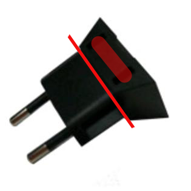
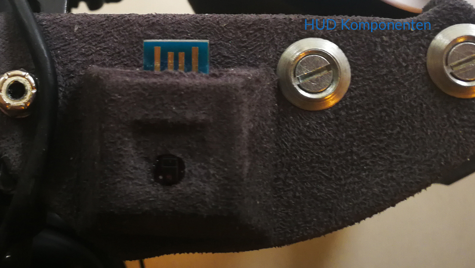
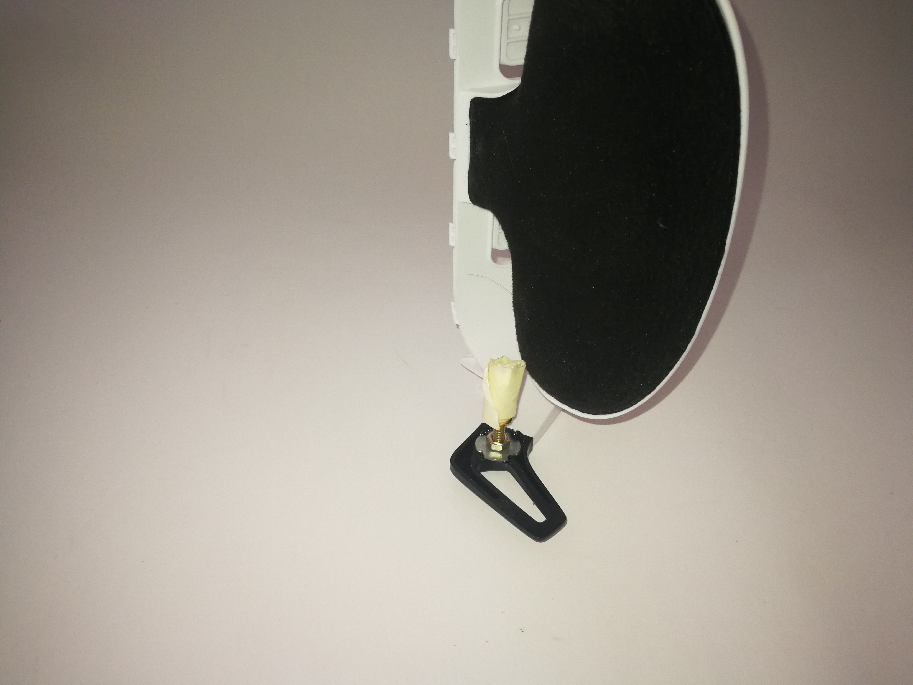
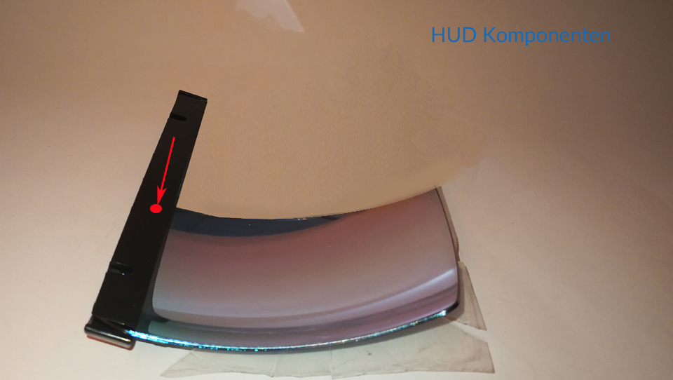
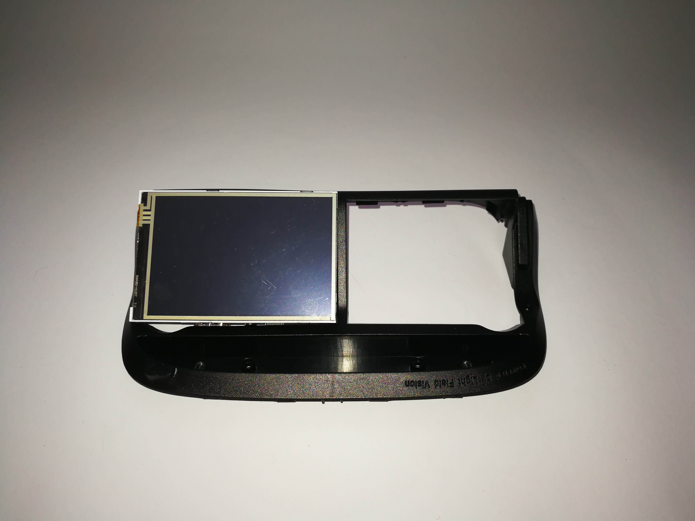
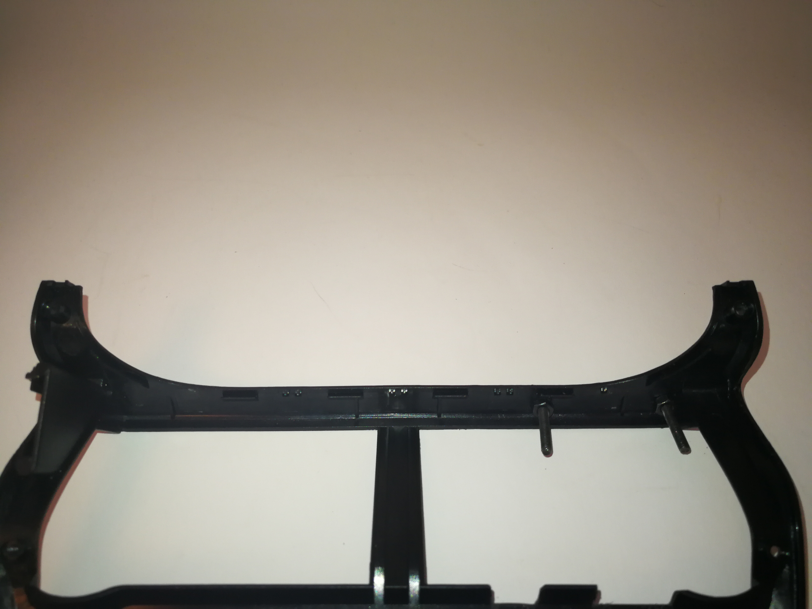
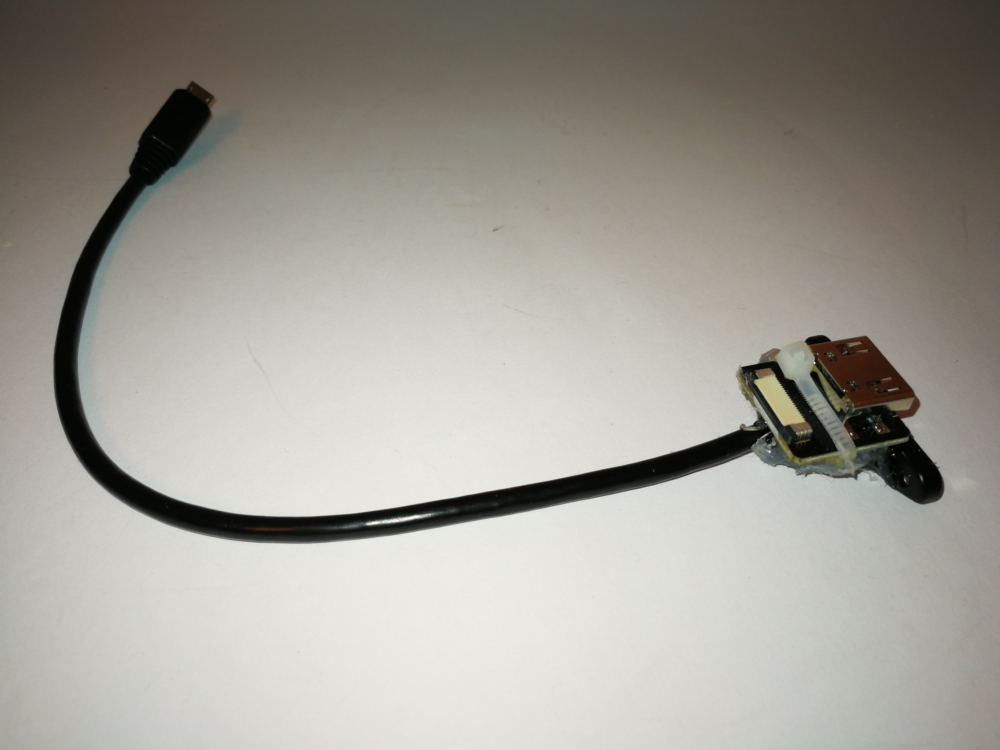
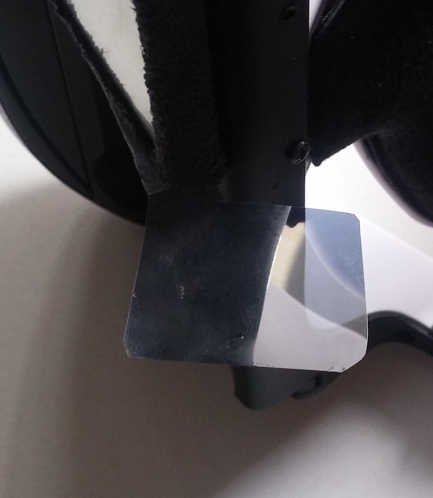

#STRATUX/FLARM Wearable Pilot HUD (Maturaarbeit/School project 2018)

## Introduction

This DIY Pilot HUD project is based on John’s great work and help "Danke"

_*Caution:*_ Getting used to the HUD in flight might take some time, so taking a safety pilot or instructor with you is strongly recommended. Use the Wearable Pilot HUD at your own risk and enjoy.

_*NOTE:*_ This project relies on having a [Stratux](http://stratux.me/) build with AHRS and GPS and a FLARM antenna using this image as of 10/10 2018: https://github.com/PepperJo/stratux/releases/download/v1.4r5-flarm2/stratux-v1.4r5-flarm-588304c8f5.img.zip.


### Wearable Pilot HUD

Using the "AR Glasses" 3.5inches LCD Monitor and a Raspberry Pi 3.


Estimated cost is $187

- $49 for AR Glasses 
- $39 for 3.5inch RPi LCD 
- $20 for Gesture control from Nevma project
- $49 for PowerBar
- $30 Cables / plastic for side pieces / srews

(I used an old Flightcom Venture type headset. It has to have a screw for adjustment in order to attach the plastic connection piece on either side)

(An old bike helmed gave me the head adjustment function for a better and tighter fit)

(The gray stuff is self-adhesive alcantara fabric for car interiors)

(Requires your aircraft to have a "12 Volt" cigarette power outlet or sizeable powerbar)


## In Flight Controls

In order to change the windows, I use the gesture control project from NEVMA
https://www.hackster.io/platisd/nevma-gesture-control-for-the-masses-9cff03
I use the proximity script since it is less touchy in flight. 

For the geuster controller case I used an old HTC EU Plug (HTC TC P300 Travel Charger
Model: 79H00079-02M). I cut off the two power plug prongs on the base to fit the controller inside. On the side of the two holes I made an cut out for the USB connector. You want to use epoxy glue and fix so that the lips of the USB conector hold it place (clips/locks on to the case lip) when you move your head





This way you will scroll through the windows quickly. 
You will also have to make chages in "heads_up_display.py" because I can't find a plus key in Arduino
```diff

sudo nano /home/pi/StratuxHud/heads_up_display.py

if event.key in [pygame.K_KP_PLUS, pygame.K_PLUS]:

to 

if event.key in [pygame.K_RIGHT]:
```
Sketch:
```diff
#include <SparkFun_APDS9960.h>
#include <Keyboard.h>
// Global Variables
SparkFun_APDS9960 apds = SparkFun_APDS9960();
uint8_t proximity_data = 0;
int LED_PIN = 3; // JJD LED for if then

void setup() {

pinMode(LED_PIN,OUTPUT); //configure LED_PIN as OUTPUT 

 
 // Initialize Serial port
 Serial.begin(9600);
 Serial.println();
 Serial.println(F("------------------------------------"));
 Serial.println(F("SparkFun APDS-9960 - ProximitySensor"));
 Serial.println(F("------------------------------------"));
 
 // Initialize APDS-9960 (configure I2C and initial values)
 if ( apds.init() ) {
 Serial.println(F("APDS-9960 initialization complete"));
 } else {
 Serial.println(F("Something went wrong during APDS-9960 init!"));
 }
 
 // Adjust the Proximity sensor gain
 if ( !apds.setProximityGain(PGAIN_2X) ) {
 Serial.println(F("Something went wrong trying to set PGAIN"));
 }
 
 // Start running the APDS-9960 proximity sensor (no interrupts)
 if ( apds.enableProximitySensor(false) ) {
 Serial.println(F("Proximity sensor is now running"));
 } else {
 Serial.println(F("Something went wrong during sensor init!"));
 }
}

void loop() {
 
 // Read the proximity value
 if ( !apds.readProximity(proximity_data) ) {
 Serial.println("Error reading proximity value");
 
 } else {

 }
//Max value is 255 to make it more or less sensetive change the value in WINDOW OFF, Proximity under and WINDOW ON!! Proximity over 
 if ( proximity_data < 100 ) {
 Serial.print("WINDOW OFF, Proximity under 100: ");
 Serial.println(proximity_data); 
 Keyboard.releaseAll();
 } else {
 Serial.print("WINDOW ON!! Proximity over 100: ");
 Serial.println(proximity_data);
 Keyboard.press(KEY_RIGHT_ARROW);
 }
 delay(600);

}
```
## Software changes to better fit text (lower) on to the glass

Some of the text was for me to high up on the glass. As of v1.3 (Feb 2019) you will have to add the following code in altitude.py only. I left the G-Meter text (you can remove the code for it in the HUDconfig web interface). I changed the value for both to "3" in:
```diff
sudo nano /home/pi/StratuxHud/views/altitude.py

"self.__text_y_pos__ = center_y - text_half_height"
            
 to
 
 "self.__text_y_pos__ = (text_half_height << 3) + \
            center_y - text_half_height"

sudo nano /home/pi/StratuxHud/views/groundspeed.py

"self.__text_y_pos__ = (text_half_height << 2) + \
            center_y - text_half_height"
            
 to
 
 "self.__text_y_pos__ = (text_half_height << 3) + \
            center_y - text_half_height"
            
``` 
          
 Changed the two text color (altitude.py / groundspeed.py) from WHITE to GREEN as showen in the example code from the altitude.py file
 
 ```diff
                 texture = self.__font__.render(
            groundspeed_text, True, WHITE, BLACK)
         
         to
         
         texture = self.__font__.render(
            groundspeed_text, True, GREEN, BLACK)
            
 ```

### Software changes on raspberry

you may need diffrent values these are just rough for now

```diff 
sudo nano /boot/config.txt

disable_overscan=1

overscan_left=200

overscan_right=400

overscan_top=200

overscan_bottom=0

max_usb_current=1
```

## Source for HUD systems 

You can find all your parts for the Wearable Pilot HUD here:

OSFS.GA WEARABLE PILOT HUD: https://www.osfs.ga/store/wearable-pilot-hud-c-68/ 

If you are looking for a HUD which is dash or overhead mounted you can find them here:

OSFS.GA DASHBOARD PILOT HUD or OVERHEAD PILOT HUD: https://www.osfs.ga/store

## Hardware Improvement

Better FLARM antenna
http://www.gliderdesignparts.de/ant_flarm.html

### HUD Build

## Install instructions Software

 **The way it worked for me**
 
Install Stratux with or without FLARM. The image I used is in 10/10 2018: https://github.com/PepperJo/stratux/releases/download/v1.4r5-flarm2/stratux-v1.4r5-flarm-588304c8f5.img.zip

Just make sure you set the Raspberry PI system time before you start to install next the StratuxHud software
```diff
sudo /etc/init.d/ntp stop

sudo /etc/init.d/ntp start
```
Install and follow John’s StratuxHud software instructions 

https://github.com/JohnMarzulli/StratuxHud

Install John’s HudConfig, you will need this web interface in order to mirror the display for the Hud " Flip Horizontal"

https://github.com/JohnMarzulli/HudConfig

## Install instructions Hardware
1.	Cut out the plastic connection piece out of mendable and non-brittle material (Download Sketchup file: media/RJ glasses mountv4.skp)

2.	(use at on risk) Heat up M4 Steel T Nuts / Captive nuts, use a long bolt with a lot of tape on the end of it and slowly press the nut into the plastic of the AR Glasses



3.	Cut glass in half, by using a lot of masking tape to give you an edge for cutting. Edge out a grove. Be careful not to scratch the glass. (use at own risk) Heat up the blade tip of a metal xacto knife and cut through the plastic. Sand the edges smooth afterwards


4.	(use at own risk) With a small awl or large needle put the glass in the black plastic glass holder and meld a hole through the glass and the holder so that you can mount the glass with a very small screw on both sides



5.	I mounted the monitor on the outside of the holder because of alignment issues with the glass. Using the center plastic divider piece as a guide, I marked the HDMI and the USB ports on top and on the bottom left and right of the monitor GPIO. Cut out the two spaces for the ports and (use at own risk) melt two holes with a small awl, for an M2 bolt with about 2-2.5 cm length. On either side of the GPIO and mount the bolts with a nut to the black frame.




6.	I did not want to connect to the monitor directly to the raspberry, just in case I get the cables tangled in the cockpit and rip out the ports. So I bought a micro-USB cable for an installation in a case “delock kabel usb 2.0 micro-b buchse zum einbau” and solder two pins on it (USB port fell off during testing). I also bought a ribbon and Adafruit socket and plug for it. I attached the HDMI socket and micro-USB socket together with hot glue and a very small cable binder. I cut out a cover for the sockets and attached the cover with bolds to the connection sockets. In the middle of the glasses is a large hole where you can hot glue cover bracket with the socket on it and run the cable in side to the monitor.




7.	Bend very slowly the Adafruit HDMI plug so it has the same angle as the plastic frame of the AR Glasses

8.	Attach the monitor to the AR Glasses by inserting the top first and then by pushing the GPIO between the two bolds. I used very small long cable binder which fit through the middle of the GPIO and around the two bold in order to fix the monitor to the frame


9.	Attach ribbon to HDMI socket and plug in the USB cbale in GPIO pins on 2 and 4 (lower row from the left side)

10.	Close it up and (use at own risk) melt a hole through the middle lower connection point and secure it with a screw since it will snap open quite easily without it.

11.	I mounted the gesture control sensor on the passenger side directly on to the connection plastic between the headset and the AR glasses. USB plug pointing up

12.	I attached the bike helmet strap on the back frame of the headset with very strong thread

13.	View splitter for the right eye. Use a very thin non reflective plastic. Cut it to shape as shown in the image and attach it with double sticking tape on to the side of the monitor. It helps to eliminated viewing distortion through the right eye.



## ADS-B/Flarm Anntena Reception optimisation/programming

The whole thing works over ssh:
```diff
Stxstop

kal -d 0 -b GSM900 -c 45 -g 0 (with this the PPM 1 is measured)

kal -d 1 -b GSM900 -c 45 -g 0 (with this the PPM 2 is measured)

The result is to be adjusted for 1.PPM, e.g.= 27, and the result 2.PPM e.g.= 19

rtl_eeprom -d0 -s stx:1090:27 (with this the 1st SDR is programmed, here the ADS-B SDR)

rtl_eeprom -d1 -s stx:0:19 (as PPM example "19" for the 2nd SDR which is used for FLARM)

"stx:0" means that no frequency is assigned to the 2.SDR, but then it is automatically used for FLARM.

Power Off and restart.
```

Assignment of USB Ports Manual (https://github.com/cyoung/stratux/wiki/FAQ)
```diff
Switch to root.

$ sudo su -

Depending on the version of Stratux some or all of the following commands may be required to shut down the Stratux processes.

service stratux stop

screen -x stratux Ctrl-C

screen -x dump1090 Ctrl-C

Ensure only the 978 MHz SDR is plugged in.

rtl_eeprom -d 0 -s stratux:978

Unplug the 978 MHz SDR and plug in the 1090 MHz SDR.

rtl_eeprom -d 0 -s stratux:1090

Plug the 978 MHz SDR back in.

shutdown -r now

```
Assignment of USB Ports Automatic (https://github.com/cyoung/stratux/wiki/SDR-Serials)

Stratux has a script to automate this process of setting the SDR Serials.
```diff
SSH into Stratux and do:

Type sudo su -

Type sdr-tool.sh

READ THE SCREEN
```
## How to Update StartuxHud
```diff
sudo rm -r  /home/pi/StratuxHud/

cd ~

git clone https://github.com/JohnMarzulli/StratuxHud.git

..reapply changes from “Software changes to better fit text(lower)on to the glass” above and "In Flight Controls"

```
## Interesting Projects

DIY avionics for experimental aircrafts:

http://experimentalavionics.com

French spinoff with AHRS and standard instrument layout option:

http://www.etna-soft.com


## License

This project is covered by the GPL v3 license.

Please see [LICENSE](LICENSE)
